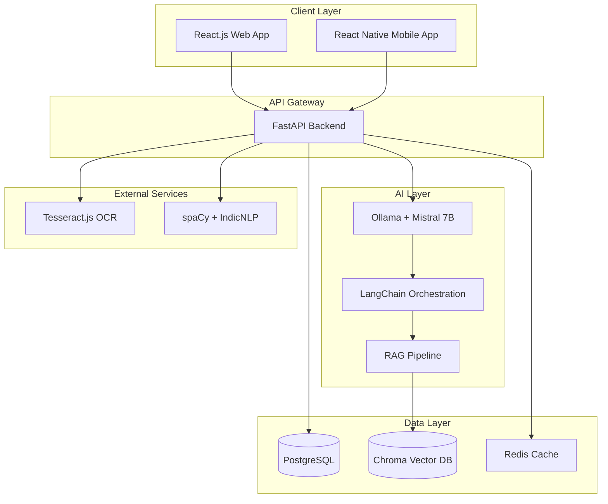
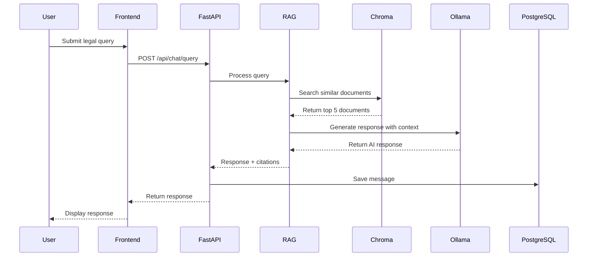
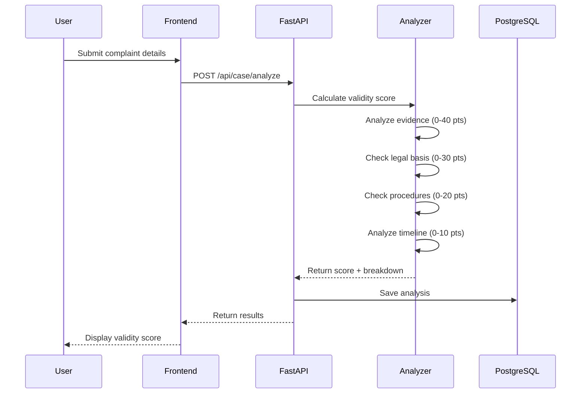
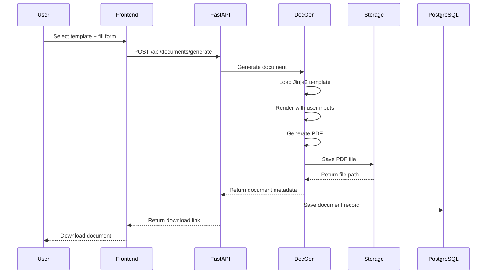

# Design Document: Nyaya Mitra

## Overview

Nyaya Mitra is an AI-powered legal assistance platform built using a modern, scalable architecture with a React.js frontend, Python FastAPI backend, and Ollama-powered AI system. The platform uses Retrieval-Augmented Generation (RAG) to provide grounded, accurate legal guidance by combining large language models with a vector database of Indian legal knowledge.

The system is designed to be completely free and open-source, leveraging cost-effective hosting solutions (Vercel for frontend, Render for backend) to serve millions of Indian college students without financial barriers.

### Key Design Principles

1. **Accuracy through RAG**: All AI responses are grounded in retrieved legal documents to minimize hallucinations
2. **Privacy-first**: End-to-end encryption, no data sharing, user data deletion on request
3. **Accessibility**: Multilingual support, mobile-first design, works on low-bandwidth connections
4. **Scalability**: Stateless backend, vector database for fast retrieval, efficient caching
5. **Open-source**: All components use free, open-source technologies

## Architecture

### High-Level Architecture



### Component Architecture

The system follows a layered architecture:
5. **Data Layer**: PostgreSQL for structured data, Chroma for vector embeddings, Redis for cach

1. **Presentation Layer**: React.js (web) and React Native (mobile) with Chakra UI and Tailwind CSS
2. **API Layer**: FastAPI with RESTful endpoints and WebSocket support for real-time chat
3. **Business Logic Layer**: Python services for chat, case analysis, document generation, and search
4. **AI/ML Layer**: Ollama with Mistral 7B, LangChain for orchestration, RAG pipelineing

### Technology Stack Rationale

- **Frontend (React.js)**: Component-based, large ecosystem, excellent mobile support via React Native
- **Backend (FastAPI)**: High performance, automatic API documentation, async support, Python ecosystem
- **AI (Ollama + Mistral 7B)**: Free, runs locally, no API costs, privacy-preserving, good multilingual support
- **Vector DB (Chroma)**: Open-source, easy integration with LangChain, efficient sihosting on Render
- **Hosting**: Vercel (frontend) and Render (backend) offer generous free tiers

## Components and Interfaces
milarity search
- **Database (PostgreSQL)**: Robust, ACID compliant, excellent JSON support, free 
### 1. Frontend Components

#### Web Application (React.js)

**Core Components**:
- `ChatInterface`: Real-time chat with AI, message history, typing indicators
- `CaseAnalyzer`: Form for complaint details, validity score display, breakdown visualization
- `ActionPlanViewer`: Step-by-step guidance with timeline, progress tracking
- `DocumentGenerator`: Template selection, form inputs, document preview and download
- `LegalAidSearch`: Search filters, provider cards, contact information display
- `LanguageSelector`: Language switching, persistent preference storage
- `EvidenceGuide`: Case-type specific instructions, checklists, visual aids
- `EmergencyPanel`: Quick access emergency contacts, one-tap calling
- `AuthForms`: Login, registration, password reset

**State Management**: React Context API for global state (user, language, theme), local state for component-specific data

**Routing**: React Router for navigation between features

#### Mobile Application (React Native)

**Additional Mobile-Specific Components**:
- `BiometricAuth`: Fingerprint/Face ID authentication
- `OfflineCache`: Local storage for essential features
- `PushNotifications`: Alert system for important updates
- `CameraUpload`: Direct camera access for document capture

### 2. Backend API (FastAPI)

#### API Endpoints

**Authentication**:
- `POST /api/auth/register`: Create new user account
- `POST /api/auth/login`: Authenticate and receive JWT token
- `POST /api/auth/refresh`: Refresh expired JWT token
- `DELETE /api/auth/account`: Delete user account and data

**Chat System**:
- `POST /api/chat/query`: Submit legal query, receive AI response
- `GET /api/chat/history`: Retrieve conversation history
- `WebSocket /api/chat/stream`: Real-time streaming responses

**Case Analysis**:
- `POST /api/case/analyze`: Submit complaint details, receive validity score
- `GET /api/case/history`: Retrieve past analyses

**Document Generation**:
- `GET /api/documents/templates`: List available document types
- `POST /api/documents/generate`: Generate document from template
- `GET /api/documents/{id}`: Retrieve generated document

**Legal Aid**:
- `GET /api/legal-aid/search`: Search legal aid providers with filters
- `GET /api/legal-aid/{id}`: Get detailed provider information

**OCR**:
- `POST /api/ocr/upload`: Upload image, receive extracted text
- `POST /api/ocr/verify`: Submit corrected OCR text

**Emergency**:
- `GET /api/emergency/contacts`: Get location-specific emergency contacts

#### Middleware

- **Authentication Middleware**: Verify JWT tokens, attach user context
- **Rate Limiting**: Prevent abuse (100 requests per hour per user)
- **CORS**: Configure allowed origins for web and mobile apps
- **Error Handling**: Standardized error responses with appropriate HTTP codes
- **Logging**: Request/response logging for debugging and analytics

### 3. AI/ML Services

#### RAG Pipeline

**Components**:
1. **Query Processor**: Clean and normalize user queries, detect language
2. **Embedding Generator**: Convert queries to vector embeddings using Sentence-Transformers
3. **Vector Retriever**: Search Chroma database for top-k relevant documents
4. **Context Builder**: Format retrieved documents as context for LLM
5. **Response Generator**: Use Ollama + Mistral 7B to generate grounded responses
6. **Citation Extractor**: Identify and format legal citations in responses

**RAG Flow**:
```python
def rag_query(user_query: str, language: str) -> dict:
    # 1. Process query
    processed_query = query_processor.clean(user_query)
    
    # 2. Generate embedding
    query_embedding = embedding_model.encode(processed_query)
    
    # 3. Retrieve relevant documents
    relevant_docs = chroma_db.similarity_search(
        query_embedding, 
        k=5,
        filter={"language": language}
    )
    
    # 4. Build context
    context = context_builder.format(relevant_docs)
    
    # 5. Generate response
    prompt = f"""Context: {context}
    
    User Question: {user_query}
    
    Provide accurate legal guidance based only on the context above."""
    
    response = ollama.generate(
        model="mistral:7b",
        prompt=prompt,
        temperature=0.3
    )
    
    # 6. Extract citations
    citations = citation_extractor.extract(response, relevant_docs)
    
    return {
        "response": response,
        "citations": citations,
        "confidence": calculate_confidence(relevant_docs)
    }
```

#### Case Validity Analyzer

**Scoring Algorithm**:
```python
def calculate_validity_score(complaint_details: dict) -> dict:
    score = 0
    breakdown = {}
    
    # Evidence strength (0-40 points)
    evidence_score = analyze_evidence(complaint_details["evidence"])
    score += evidence_score
    breakdown["evidence"] = evidence_score
    
    # Legal basis (0-30 points)
    legal_basis_score = check_legal_basis(complaint_details["allegations"])
    score += legal_basis_score
    breakdown["legal_basis"] = legal_basis_score
    
    # Procedural compliance (0-20 points)
    procedural_score = check_procedures(complaint_details["procedures"])
    score += procedural_score
    breakdown["procedural"] = procedural_score
    
    # Timeline reasonableness (0-10 points)
    timeline_score = analyze_timeline(complaint_details["timeline"])
    score += timeline_score
    breakdown["timeline"] = timeline_score
    
    return {
        "validity_score": score,
        "breakdown": breakdown,
        "weaknesses": identify_weaknesses(breakdown),
        "recommendations": generate_recommendations(score, breakdown)
    }
```

#### Document Generator

**Template System**:
- Templates stored as Jinja2 files with placeholders
- User inputs mapped to template variables
- PDF generation using ReportLab library
- Support for multiple document types: legal letters, RTI applications, counter-petitions

**Generation Flow**:
```python
def generate_document(template_type: str, user_inputs: dict) -> bytes:
    # 1. Load template
    template = jinja_env.get_template(f"{template_type}.j2")
    
    # 2. Validate inputs
    validate_inputs(template_type, user_inputs)
    
    # 3. Render template
    rendered_text = template.render(**user_inputs)
    
    # 4. Generate PDF
    pdf_bytes = pdf_generator.create(rendered_text)
    
    return pdf_bytes
```

#### Multilingual NLP

**Language Detection and Translation**:
- Use `langdetect` for automatic language detection
- spaCy for English text processing
- IndicNLP for Hindi and regional languages
- Translation using pre-trained models from HuggingFace

**Text Processing Pipeline**:
```python
def process_multilingual_text(text: str) -> dict:
    # 1. Detect language
    detected_lang = langdetect.detect(text)
    
    # 2. Select appropriate NLP model
    if detected_lang == "en":
        nlp = spacy_en
    elif detected_lang == "hi":
        nlp = indic_nlp_hi
    else:
        nlp = indic_nlp_generic
    
    # 3. Process text
    doc = nlp(text)
    
    # 4. Extract entities and keywords
    entities = extract_entities(doc)
    keywords = extract_keywords(doc)
    
    return {
        "language": detected_lang,
        "entities": entities,
        "keywords": keywords,
        "processed_text": doc
    }
```

### 4. Data Models

#### User Model

```python
class User(Base):
    __tablename__ = "users"
    
    id: UUID = Column(UUID(as_uuid=True), primary_key=True, default=uuid4)
    email: str = Column(String(255), unique=True, nullable=False)
    password_hash: str = Column(String(255), nullable=False)
    full_name: str = Column(String(255), nullable=False)
    college_name: str = Column(String(255), nullable=True)
    preferred_language: str = Column(String(10), default="en")
    created_at: datetime = Column(DateTime, default=datetime.utcnow)
    last_login: datetime = Column(DateTime, nullable=True)
    is_active: bool = Column(Boolean, default=True)
    
    # Relationships
    conversations: List["Conversation"] = relationship("Conversation", back_populates="user")
    case_analyses: List["CaseAnalysis"] = relationship("CaseAnalysis", back_populates="user")
    generated_documents: List["GeneratedDocument"] = relationship("GeneratedDocument", back_populates="user")
```

#### Conversation Model

```python
class Conversation(Base):
    __tablename__ = "conversations"
    
    id: UUID = Column(UUID(as_uuid=True), primary_key=True, default=uuid4)
    user_id: UUID = Column(UUID(as_uuid=True), ForeignKey("users.id"), nullable=False)
    title: str = Column(String(255), nullable=True)
    language: str = Column(String(10), default="en")
    created_at: datetime = Column(DateTime, default=datetime.utcnow)
    updated_at: datetime = Column(DateTime, onupdate=datetime.utcnow)
    
    # Relationships
    user: "User" = relationship("User", back_populates="conversations")
    messages: List["Message"] = relationship("Message", back_populates="conversation")
```

#### Message Model

```python
class Message(Base):
    __tablename__ = "messages"
    
    id: UUID = Column(UUID(as_uuid=True), primary_key=True, default=uuid4)
    conversation_id: UUID = Column(UUID(as_uuid=True), ForeignKey("conversations.id"), nullable=False)
    role: str = Column(String(20), nullable=False)  # "user" or "assistant"
    content: str = Column(Text, nullable=False)
    citations: JSON = Column(JSON, nullable=True)
    confidence_score: float = Column(Float, nullable=True)
    created_at: datetime = Column(DateTime, default=datetime.utcnow)
    
    # Relationships
    conversation: "Conversation" = relationship("Conversation", back_populates="messages")
```

#### CaseAnalysis Model

```python
class CaseAnalysis(Base):
    __tablename__ = "case_analyses"
    
    id: UUID = Column(UUID(as_uuid=True), primary_key=True, default=uuid4)
    user_id: UUID = Column(UUID(as_uuid=True), ForeignKey("users.id"), nullable=False)
    complaint_details: JSON = Column(JSON, nullable=False)
    validity_score: int = Column(Integer, nullable=False)
    score_breakdown: JSON = Column(JSON, nullable=False)
    weaknesses: JSON = Column(JSON, nullable=True)
    recommendations: JSON = Column(JSON, nullable=True)
    created_at: datetime = Column(DateTime, default=datetime.utcnow)
    
    # Relationships
    user: "User" = relationship("User", back_populates="case_analyses")
```

#### GeneratedDocument Model

```python
class GeneratedDocument(Base):
    __tablename__ = "generated_documents"
    
    id: UUID = Column(UUID(as_uuid=True), primary_key=True, default=uuid4)
    user_id: UUID = Column(UUID(as_uuid=True), ForeignKey("users.id"), nullable=False)
    document_type: str = Column(String(50), nullable=False)
    template_inputs: JSON = Column(JSON, nullable=False)
    file_path: str = Column(String(500), nullable=False)
    created_at: datetime = Column(DateTime, default=datetime.utcnow)
    
    # Relationships
    user: "User" = relationship("User", back_populates="generated_documents")
```

#### LegalAidProvider Model

```python
class LegalAidProvider(Base):
    __tablename__ = "legal_aid_providers"
    
    id: UUID = Column(UUID(as_uuid=True), primary_key=True, default=uuid4)
    name: str = Column(String(255), nullable=False)
    organization_type: str = Column(String(100), nullable=False)
    specializations: JSON = Column(JSON, nullable=False)
    languages_supported: JSON = Column(JSON, nullable=False)
    contact_phone: str = Column(String(20), nullable=True)
    contact_email: str = Column(String(255), nullable=True)
    address: str = Column(Text, nullable=True)
    city: str = Column(String(100), nullable=False)
    state: str = Column(String(100), nullable=False)
    is_verified: bool = Column(Boolean, default=False)
    created_at: datetime = Column(DateTime, default=datetime.utcnow)
    updated_at: datetime = Column(DateTime, onupdate=datetime.utcnow)
```

#### VectorDocument Model (Chroma)

```python
# Stored in Chroma vector database
class VectorDocument:
    id: str  # Unique document ID
    content: str  # Legal text content
    embedding: List[float]  # Vector embedding
    metadata: dict  # {
        #   "source": "IPC Section 499",
        #   "category": "defamation",
        #   "language": "en",
        #   "last_updated": "2024-01-15"
        # }
```

## Data Flow Diagrams

### Chat Query Flow



### Case Analysis Flow



### Document Generation Flow




## Correctness Properties

*A property is a characteristic or behavior that should hold true across all valid executions of a system—essentially, a formal statement about what the system should do. Properties serve as the bridge between human-readable specifications and machine-verifiable correctness guarantees.*

### Chat System Properties

**Property 1: Response time bound**
*For any* legal query submitted by a user, the AI_Chat_System should generate and return a response within 5 seconds.
**Validates: Requirements 1.1**

**Property 2: Language consistency**
*For any* query submitted in a supported language, the AI_Chat_System should respond in the same language as the input.
**Validates: Requirements 1.2, 6.5**

**Property 3: RAG retrieval requirement**
*For any* query processed by the AI_Chat_System, the RAG_System should retrieve context from the Legal_Knowledge_Base before generating the response.
**Validates: Requirements 1.3**

**Property 4: Citation presence**
*For any* AI response where retrieved documents contain legal references, the response should include citations to specific Indian laws, sections, or precedents.
**Validates: Requirements 1.4**

**Property 5: Ambiguity handling**
*For any* query classified as ambiguous (confidence score < 0.6), the AI_Chat_System should ask clarifying questions rather than providing direct guidance.
**Validates: Requirements 1.5**

**Property 6: Context preservation**
*For any* conversation with multiple messages, follow-up queries should have access to previous messages in the session, enabling contextual responses.
**Validates: Requirements 1.6**

**Property 7: Low confidence disclaimer**
*For any* query where the confidence score is below 0.7, the AI response should include an acknowledgment of limitations and suggest consulting a legal professional.
**Validates: Requirements 1.7**

### Case Analysis Properties

**Property 8: Validity score bounds**
*For any* complaint details provided to the Case_Analyzer, the generated Validity_Score should be an integer between 0 and 100 (inclusive).
**Validates: Requirements 2.1**

**Property 9: Score breakdown completeness**
*For any* case analysis, the score breakdown should include all three components: evidence strength, legal basis, and procedural compliance.
**Validates: Requirements 2.2, 2.3**

**Property 10: Weakness highlighting for low scores**
*For any* case analysis with Validity_Score below 40, the response should include a non-empty list of highlighted weaknesses.
**Validates: Requirements 2.4**

**Property 11: Legal consultation recommendation for high scores**
*For any* case analysis with Validity_Score above 70, the response should include a recommendation for immediate legal consultation.
**Validates: Requirements 2.5**

**Property 12: Missing elements identification**
*For any* case analysis, the response should identify at least one missing element that would strengthen or weaken the case, or explicitly state that the case is complete.
**Validates: Requirements 2.6**

### Action Plan Properties

**Property 13: Numbered steps structure**
*For any* action plan generated, the plan should contain a list of steps where each step has a sequential number starting from 1.
**Validates: Requirements 3.1**

**Property 14: Timeline presence**
*For any* action plan generated, each step should include a timeline field with specific time information (date, duration, or deadline).
**Validates: Requirements 3.2**

**Property 15: Deadline highlighting**
*For any* action plan containing legal deadlines, those deadlines should be marked with a highlight flag or prominent indicator.
**Validates: Requirements 3.3**

**Property 16: Urgency ordering**
*For any* action plan with steps of varying urgency levels, urgent steps (urgency > 7/10) should appear before non-urgent steps.
**Validates: Requirements 3.4**

**Property 17: Time estimate presence**
*For any* action plan generated, each step should include an estimated time requirement field.
**Validates: Requirements 3.5**

### Document Generation Properties

**Property 18: Form presentation**
*For any* document type selected, the Document_Generator should return a form structure containing all required fields for that document type.
**Validates: Requirements 4.1**

**Property 19: Document generation from valid input**
*For any* valid form submission (all required fields filled), the Document_Generator should successfully generate a Legal_Document without errors.
**Validates: Requirements 4.2**

**Property 20: Dual format output**
*For any* generated Legal_Document, the Platform should provide both PDF and editable text format versions.
**Validates: Requirements 4.5**

**Property 21: Placeholder inclusion**
*For any* generated document with optional fields left empty, the document should contain clearly marked placeholders (e.g., "[INSERT NAME]") for manual completion.
**Validates: Requirements 4.6**

**Property 22: Attachment checklist**
*For any* document type that requires attachments, the generated document should include a checklist of required supporting documents.
**Validates: Requirements 4.7**

### Legal Aid Search Properties

**Property 23: Location and case type filtering**
*For any* legal aid search with location and case type parameters, all returned Legal_Aid_Providers should match both the specified location and case type.
**Validates: Requirements 5.1**

**Property 24: Provider information completeness**
*For any* Legal_Aid_Provider in search results, the response should include contact information, specializations, and availability fields.
**Validates: Requirements 5.2**

**Property 25: Multi-criteria filtering**
*For any* search with filters for language, location, and expertise, all returned results should satisfy all three filter criteria.
**Validates: Requirements 5.3**

**Property 26: Multiple contact methods**
*For any* Legal_Aid_Provider detail view, the response should include at least two different contact methods (phone, email, address, or website).
**Validates: Requirements 5.4**

**Property 27: National fallback**
*For any* legal aid search that returns zero local results, the response should include at least one national helpline or online service as a fallback option.
**Validates: Requirements 5.6**

### Multilingual Properties

**Property 28: UI language consistency**
*For any* language selection, all interface elements (buttons, labels, menus, error messages) should be displayed in the selected language.
**Validates: Requirements 6.2**

**Property 29: Language switching**
*For any* active session, changing the language preference should immediately update all subsequent responses and UI elements to the new language.
**Validates: Requirements 6.4**

**Property 30: Translation consistency**
*For any* legal term that appears in multiple features or screens, the translation in the selected language should be identical across all occurrences.
**Validates: Requirements 6.6**

### Evidence Guide Properties

**Property 31: Case-specific guidance**
*For any* evidence guidance request with a specified case type, the returned Evidence_Guide should contain instructions specific to that case type.
**Validates: Requirements 7.1**

**Property 32: Digital preservation instructions**
*For any* Evidence_Guide generated, the guide should include a section on digital evidence preservation with at least 3 specific instructions.
**Validates: Requirements 7.2**

**Property 33: Admissibility requirements**
*For any* Evidence_Guide generated, the guide should include an explanation of legal requirements for evidence admissibility.
**Validates: Requirements 7.3**

**Property 34: Step-by-step format with visuals**
*For any* evidence collection instructions, the guide should be formatted as numbered steps and include at least one visual aid reference.
**Validates: Requirements 7.4**

**Property 35: Evidence type checklists**
*For any* evidence type (physical, digital, testimonial, documentary), the Platform should provide a checklist with at least 5 items.
**Validates: Requirements 7.5**

**Property 36: Tampering warnings**
*For any* Evidence_Guide generated, the guide should include a warning about evidence tampering and its legal consequences.
**Validates: Requirements 7.6**

**Property 37: Digital communication procedures**
*For any* case involving digital communications, the Evidence_Guide should include specific procedures for screenshots and backups.
**Validates: Requirements 7.7**

### Emergency SOS Properties

**Property 38: Emergency response time**
*For any* emergency feature activation, the Platform should display Emergency_Contacts within 1 second.
**Validates: Requirements 8.2**

**Property 39: Contact categorization**
*For any* emergency contacts response, the contacts should be organized into at least four categories: police, legal helplines, mental health support, and student services.
**Validates: Requirements 8.3**

**Property 40: Callable phone numbers**
*For any* Emergency_Contact displayed, the contact should include a phone number field with one-tap calling capability enabled.
**Validates: Requirements 8.4**

**Property 41: Location-specific contacts**
*For any* user with a specified location (state or city), the emergency contacts should include at least one contact specific to that location.
**Validates: Requirements 8.5**

**Property 42: National fallback contacts**
*For any* emergency contacts response, the list should include at least two national emergency numbers regardless of user location.
**Validates: Requirements 8.6**

**Property 43: Evidence access in emergency mode**
*For any* user in emergency mode, the Platform should provide quick access links to evidence documentation features.
**Validates: Requirements 8.7**

### Security Properties

**Property 44: Password encryption strength**
*For any* new user account creation, the stored password hash should be generated using bcrypt with a minimum of 10 rounds.
**Validates: Requirements 9.1**

**Property 45: JWT token expiration**
*For any* successful login, the issued JWT token should have an expiration time set to exactly 24 hours from issuance.
**Validates: Requirements 9.2**

**Property 46: Data encryption at rest**
*For any* sensitive user data stored in the database (passwords, personal information, case details), the data should be encrypted using AES-256.
**Validates: Requirements 9.3**

**Property 47: TLS version requirement**
*For any* data transmission between client and server, the connection should use TLS version 1.3 or higher.
**Validates: Requirements 9.4**

**Property 48: Account deletion completeness**
*For any* user account deletion request, all associated data (conversations, case analyses, generated documents) should be removed from the database.
**Validates: Requirements 9.5**

**Property 49: Session timeout**
*For any* user session with no activity for 30 consecutive minutes, the Platform should automatically invalidate the session and require re-authentication.
**Validates: Requirements 9.7**

### RAG System Properties

**Property 50: Retrieval count consistency**
*For any* query processed by the RAG_System, exactly 5 documents should be retrieved from the Legal_Knowledge_Base (or fewer if fewer than 5 relevant documents exist).
**Validates: Requirements 10.1**

**Property 51: Response grounding**
*For any* AI-generated response, all factual legal information in the response should be traceable to content in the retrieved documents.
**Validates: Requirements 10.3**

**Property 52: Knowledge gap acknowledgment**
*For any* query where the top retrieved document has a relevance score below 0.5, the AI response should explicitly acknowledge the knowledge gap.
**Validates: Requirements 10.5**

**Property 53: Citation tracking**
*For any* response containing citations, the Platform should log which legal sources were cited for analytics purposes.
**Validates: Requirements 10.6**

**Property 54: Recency prioritization**
*For any* query where retrieved documents contain conflicting legal information, the response should prioritize information from documents with more recent dates.
**Validates: Requirements 10.7**

### OCR Properties

**Property 55: OCR processing time**
*For any* image uploaded for OCR processing, the Platform should extract and return text within 10 seconds.
**Validates: Requirements 11.1**

**Property 56: Extracted text display**
*For any* completed OCR operation, the Platform should return the extracted text in a format that allows user verification and editing.
**Validates: Requirements 11.3**

**Property 57: Text editability**
*For any* OCR-extracted text, the Platform should allow the user to modify the text before submitting it for analysis.
**Validates: Requirements 11.4**

**Property 58: Low confidence highlighting**
*For any* OCR result where the confidence score for any text segment is below 80%, that segment should be highlighted or marked for user review.
**Validates: Requirements 11.5**

**Property 59: Page limit enforcement**
*For any* document upload, if the document contains 10 or fewer pages, the upload should succeed; if it contains more than 10 pages, the upload should be rejected with an appropriate error message.
**Validates: Requirements 11.6**

**Property 60: Language-specific OCR models**
*For any* document in a regional Indian language, the Platform should select and use the OCR model trained for that specific language.
**Validates: Requirements 11.7**

### Mobile Application Properties

**Property 61: Feature parity**
*For any* feature available in the web application, an equivalent feature should be available in the mobile application with the same core functionality.
**Validates: Requirements 12.2**

**Property 62: Offline caching**
*For any* essential feature (emergency contacts, evidence guides, saved documents), the mobile app should cache the data for offline access when network connectivity is unavailable.
**Validates: Requirements 12.4**

**Property 63: Push notification delivery**
*For any* important update event (case status change, new message, deadline reminder), the Platform should send a push notification to the user's mobile device.
**Validates: Requirements 12.6**

**Property 64: Data usage minimization**
*For any* API request from the mobile application, the response payload size should be minimized through compression and only essential data should be transmitted.
**Validates: Requirements 12.7**

## Error Handling

### Error Categories

1. **User Input Errors**: Invalid form data, unsupported file formats, missing required fields
2. **Authentication Errors**: Invalid credentials, expired tokens, insufficient permissions
3. **AI/ML Errors**: Model unavailable, low confidence responses, retrieval failures
4. **External Service Errors**: OCR service failures, database connection issues
5. **Rate Limiting Errors**: Too many requests from a single user
6. **Data Validation Errors**: Malformed data, constraint violations

### Error Response Format

All API errors follow a consistent JSON structure:

```json
{
  "error": {
    "code": "ERROR_CODE",
    "message": "Human-readable error message",
    "details": {
      "field": "specific_field_name",
      "reason": "Detailed explanation"
    },
    "timestamp": "2024-01-15T10:30:00Z",
    "request_id": "uuid-v4"
  }
}
```

### Error Handling Strategies

**Graceful Degradation**:
- If RAG retrieval fails, fall back to direct LLM response with disclaimer
- If OCR fails, allow manual text input
- If translation service fails, default to English

**Retry Logic**:
- Automatic retry for transient failures (network issues, temporary service unavailability)
- Exponential backoff: 1s, 2s, 4s delays
- Maximum 3 retry attempts

**User Feedback**:
- Clear error messages in user's selected language
- Actionable suggestions for resolution
- Option to report persistent errors

**Logging and Monitoring**:
- All errors logged with full context (user ID, request parameters, stack trace)
- Critical errors trigger alerts
- Error rate monitoring with thresholds

### Specific Error Scenarios

**Chat System Errors**:
- Query too long (>2000 characters): Return error with character limit
- No relevant documents found: Acknowledge limitation, suggest rephrasing
- Model timeout: Return cached response or error with retry option

**Case Analysis Errors**:
- Insufficient information: Request specific missing details
- Invalid complaint format: Provide format guidelines
- Analysis timeout: Save partial results, allow continuation

**Document Generation Errors**:
- Missing required fields: Highlight specific fields needed
- Template not found: List available templates
- PDF generation failure: Provide text-only version

**Legal Aid Search Errors**:
- No results found: Suggest broader search criteria, show national options
- Invalid location: Request valid state/city
- Database connection failure: Show cached results if available

**OCR Errors**:
- Unsupported file format: List supported formats
- File too large: Specify size limit
- Low quality image: Suggest retaking photo with better lighting

**Authentication Errors**:
- Invalid credentials: Clear message, offer password reset
- Expired token: Automatic refresh attempt, then prompt re-login
- Account locked: Explain reason, provide unlock instructions

## Testing Strategy

### Dual Testing Approach

The Nyaya Mitra platform requires both unit testing and property-based testing to ensure comprehensive coverage and correctness.

**Unit Tests**: Focus on specific examples, edge cases, and integration points
- Specific legal query examples with known correct responses
- Edge cases like empty inputs, maximum length inputs, special characters
- Integration between components (API → RAG → Database)
- Error conditions and exception handling
- Authentication flows and security measures

**Property-Based Tests**: Verify universal properties across all inputs
- All 64 correctness properties defined above
- Each property test runs minimum 100 iterations with randomized inputs
- Properties validate invariants that must hold for all valid inputs
- Catch edge cases that manual test cases might miss

### Property-Based Testing Configuration

**Framework**: Use `hypothesis` for Python backend, `fast-check` for TypeScript frontend

**Test Configuration**:
```python
# Python example using hypothesis
from hypothesis import given, settings
import hypothesis.strategies as st

@settings(max_examples=100)
@given(query=st.text(min_size=1, max_size=2000))
def test_response_time_bound(query):
    """
    Feature: nyaya-mitra, Property 1: Response time bound
    For any legal query, response should be generated within 5 seconds
    """
    start_time = time.time()
    response = ai_chat_system.query(query)
    elapsed_time = time.time() - start_time
    
    assert elapsed_time < 5.0
    assert response is not None
```

**Tag Format**: Each property test must include a comment tag:
```
Feature: nyaya-mitra, Property {number}: {property_text}
```

### Test Coverage Goals

- **Unit Test Coverage**: Minimum 80% code coverage
- **Property Test Coverage**: All 64 correctness properties implemented
- **Integration Test Coverage**: All API endpoints tested
- **E2E Test Coverage**: Critical user flows (chat, case analysis, document generation)

### Testing Pyramid

1. **Property-Based Tests (64 tests)**: Validate universal correctness properties
2. **Unit Tests (~200 tests)**: Test individual functions and components
3. **Integration Tests (~50 tests)**: Test component interactions
4. **E2E Tests (~20 tests)**: Test complete user workflows

### Continuous Testing

- All tests run on every commit (CI/CD pipeline)
- Property tests run with 100 iterations in CI, 1000 iterations nightly
- Performance tests run weekly to catch regressions
- Security tests run on every deployment

### Test Data Management

**Synthetic Data Generation**:
- Use `faker` library for generating realistic user data
- Create synthetic legal documents for testing
- Generate multilingual test data for all supported languages

**Test Database**:
- Separate test database with seed data
- Reset database state between test runs
- Mock external services (Ollama, OCR) for faster tests

### Manual Testing

While automated tests cover most scenarios, manual testing is required for:
- UI/UX evaluation across different devices and screen sizes
- Accessibility testing with screen readers
- Multilingual content quality review
- Legal accuracy validation by domain experts
- User acceptance testing with actual students

