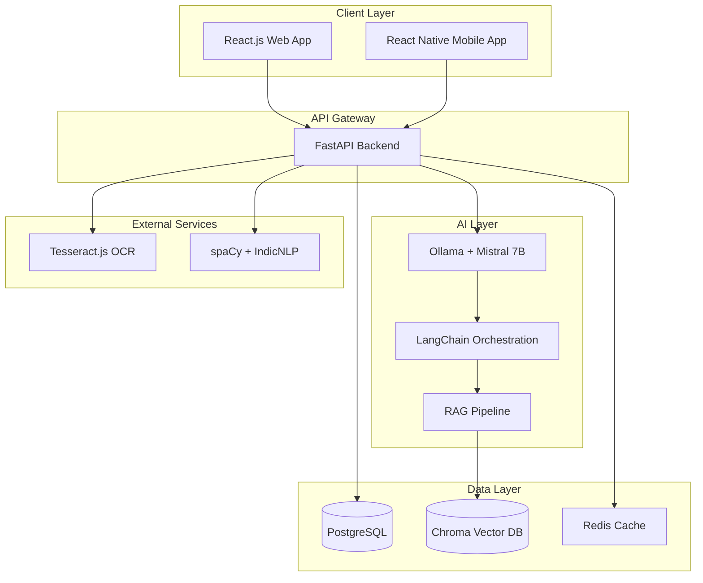
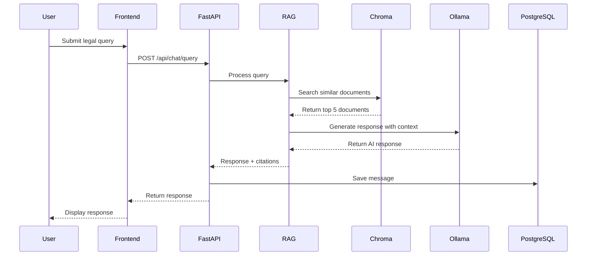
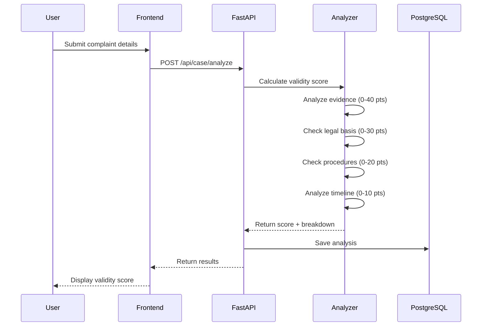
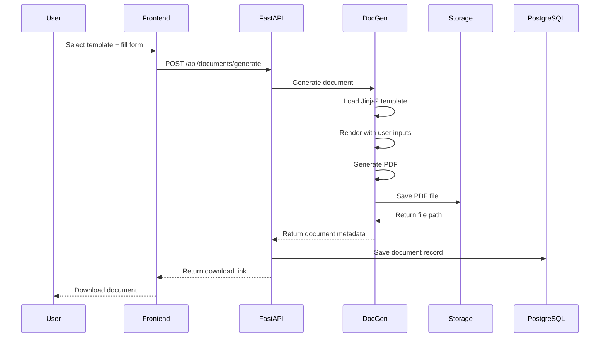

# Design Document: Nyaya Mitra

## Overview

Nyaya Mitra is an AI-powered legal assistance platform built using a modern, scalable architecture with a React.js frontend, Python FastAPI backend, and Ollama-powered AI system. The platform uses Retrieval-Augmented Generation (RAG) to provide grounded, accurate legal guidance by combining large language models with a vector database of Indian legal knowledge.

The system is designed to be completely free and open-source, leveraging cost-effective hosting solutions (Vercel for frontend, Render for backend) to serve millions of Indian college students without financial barriers.

### Key Design Principles

1. **Accuracy through RAG**: All AI responses are grounded in retrieved legal documents to minimize hallucinations
2. **Privacy-first**: End-to-end encryption, no data sharing, user data deletion on request
3. **Accessibility**: Multilingual support, mobile-first design, works on low-bandwidth connections
4. **Scalability**: Stateless backend, vector database for fast retrieval, efficient caching
5. **Open-source**: All components use free, open-source technologies

## Architecture

### High-Level Architecture



### Component Architecture

The system follows a layered architecture:

1. **Presentation Layer**: React.js (web) and React Native (mobile) with Chakra UI and Tailwind CSS
2. **API Layer**: FastAPI with RESTful endpoints and WebSocket support for real-time chat
3. **Business Logic Layer**: Python services for chat, case analysis, document generation, and search
4. **AI/ML Layer**: Ollama with Mistral 7B, LangChain for orchestration, RAG pipeline
5. **Data Layer**: PostgreSQL for structured data, Chroma for vector embeddings, Redis for caching

### Technology Stack Rationale

- **Frontend (React.js)**: Component-based, large ecosystem, excellent mobile support via React Native
- **Backend (FastAPI)**: High performance, automatic API documentation, async support, Python ecosystem
- **AI (Ollama + Mistral 7B)**: Free, runs locally, no API costs, privacy-preserving, good multilingual support
- **Vector DB (Chroma)**: Open-source, easy integration with LangChain, efficient similarity search
- **Database (PostgreSQL)**: Robust, ACID compliant, excellent JSON support, free hosting on Render
- **Hosting**: Vercel (frontend) and Render (backend) offer generous free tiers

## Components and Interfaces

### 1. Frontend Components

#### Web Application (React.js)

**Core Components**:
- `ChatInterface`: Real-time chat with AI, message history, typing indicators
- `CaseAnalyzer`: Form for complaint details, validity score display, breakdown visualization
- `ActionPlanViewer`: Step-by-step guidance with timeline, progress tracking
- `DocumentGenerator`: Template selection, form inputs, document preview and download
- `LegalAidSearch`: Search filters, provider cards, contact information display
- `LanguageSelector`: Language switching, persistent preference storage
- `EvidenceGuide`: Case-type specific instructions, checklists, visual aids
- `EmergencyPanel`: Quick access emergency contacts, one-tap calling
- `AuthForms`: Login, registration, password reset

**State Management**: React Context API for global state (user, language, theme), local state for component-specific data

**Routing**: React Router for navigation between features

#### Mobile Application (React Native)

**Additional Mobile-Specific Components**:
- `BiometricAuth`: Fingerprint/Face ID authentication
- `OfflineCache`: Local storage for essential features
- `PushNotifications`: Alert system for important updates
- `CameraUpload`: Direct camera access for document capture

### 2. Backend API (FastAPI)

#### API Endpoints

**Authentication**:
- `POST /api/auth/register`: Create new user account
- `POST /api/auth/login`: Authenticate and receive JWT token
- `POST /api/auth/refresh`: Refresh expired JWT token
- `DELETE /api/auth/account`: Delete user account and data

**Chat System**:
- `POST /api/chat/query`: Submit legal query, receive AI response
- `GET /api/chat/history`: Retrieve conversation history
- `WebSocket /api/chat/stream`: Real-time streaming responses

**Case Analysis**:
- `POST /api/case/analyze`: Submit complaint details, receive validity score
- `GET /api/case/history`: Retrieve past analyses

**Document Generation**:
- `GET /api/documents/templates`: List available document types
- `POST /api/documents/generate`: Generate document from template
- `GET /api/documents/{id}`: Retrieve generated document

**Legal Aid**:
- `GET /api/legal-aid/search`: Search legal aid providers with filters
- `GET /api/legal-aid/{id}`: Get detailed provider information

**OCR**:
- `POST /api/ocr/upload`: Upload image, receive extracted text
- `POST /api/ocr/verify`: Submit corrected OCR text

**Emergency**:
- `GET /api/emergency/contacts`: Get location-specific emergency contacts

#### Middleware

- **Authentication Middleware**: Verify JWT tokens, attach user context
- **Rate Limiting**: Prevent abuse (100 requests per hour per user)
- **CORS**: Configure allowed origins for web and mobile apps
- **Error Handling**: Standardized error responses with appropriate HTTP codes
- **Logging**: Request/response logging for debugging and analytics

### 3. AI/ML Services

#### RAG Pipeline

**Components**:
1. **Query Processor**: Clean and normalize user queries, detect language
2. **Embedding Generator**: Convert queries to vector embeddings using Sentence-Transformers
3. **Vector Retriever**: Search Chroma database for top-k relevant documents
4. **Context Builder**: Format retrieved documents as context for LLM
5. **Response Generator**: Use Ollama + Mistral 7B to generate grounded responses
6. **Citation Extractor**: Identify and format legal citations in responses

**RAG Flow**:
```python
def rag_query(user_query: str, language: str) -> dict:
    # 1. Process query
    processed_query = query_processor.clean(user_query)
    
    # 2. Generate embedding
    query_embedding = embedding_model.encode(processed_query)
    
    # 3. Retrieve relevant documents
    relevant_docs = chroma_db.similarity_search(
        query_embedding, 
        k=5,
        filter={"language": language}
    )
    
    # 4. Build context
    context = context_builder.format(relevant_docs)
    
    # 5. Generate response
    prompt = f"""Context: {context}
    
    User Question: {user_query}
    
    Provide accurate legal guidance based only on the context above."""
    
    response = ollama.generate(
        model="mistral:7b",
        prompt=prompt,
        temperature=0.3
    )
    
    # 6. Extract citations
    citations = citation_extractor.extract(response, relevant_docs)
    
    return {
        "response": response,
        "citations": citations,
        "confidence": calculate_confidence(relevant_docs)
    }
```

#### Case Validity Analyzer

**Scoring Algorithm**:
```python
def calculate_validity_score(complaint_details: dict) -> dict:
    score = 0
    breakdown = {}
    
    # Evidence strength (0-40 points)
    evidence_score = analyze_evidence(complaint_details["evidence"])
    score += evidence_score
    breakdown["evidence"] = evidence_score
    
    # Legal basis (0-30 points)
    legal_basis_score = check_legal_basis(complaint_details["allegations"])
    score += legal_basis_score
    breakdown["legal_basis"] = legal_basis_score
    
    # Procedural compliance (0-20 points)
    procedural_score = check_procedures(complaint_details["procedures"])
    score += procedural_score
    breakdown["procedural"] = procedural_score
    
    # Timeline reasonableness (0-10 points)
    timeline_score = analyze_timeline(complaint_details["timeline"])
    score += timeline_score
    breakdown["timeline"] = timeline_score
    
    return {
        "validity_score": score,
        "breakdown": breakdown,
        "weaknesses": identify_weaknesses(breakdown),
        "recommendations": generate_recommendations(score, breakdown)
    }
```

#### Document Generator

**Template System**:
- Templates stored as Jinja2 files with placeholders
- User inputs mapped to template variables
- PDF generation using ReportLab library
- Support for multiple document types: legal letters, RTI applications, counter-petitions

**Generation Flow**:
```python
def generate_document(template_type: str, user_inputs: dict) -> bytes:
    # 1. Load template
    template = jinja_env.get_template(f"{template_type}.j2")
    
    # 2. Validate inputs
    validate_inputs(template_type, user_inputs)
    
    # 3. Render template
    rendered_text = template.render(**user_inputs)
    
    # 4. Generate PDF
    pdf_bytes = pdf_generator.create(rendered_text)
    
    return pdf_bytes
```

#### Multilingual NLP

**Language Detection and Translation**:
- Use `langdetect` for automatic language detection
- spaCy for English text processing
- IndicNLP for Hindi and regional languages
- Translation using pre-trained models from HuggingFace

**Text Processing Pipeline**:
```python
def process_multilingual_text(text: str) -> dict:
    # 1. Detect language
    detected_lang = langdetect.detect(text)
    
    # 2. Select appropriate NLP model
    if detected_lang == "en":
        nlp = spacy_en
    elif detected_lang == "hi":
        nlp = indic_nlp_hi
    else:
        nlp = indic_nlp_generic
    
    # 3. Process text
    doc = nlp(text)
    
    # 4. Extract entities and keywords
    entities = extract_entities(doc)
    keywords = extract_keywords(doc)
    
    return {
        "language": detected_lang,
        "entities": entities,
        "keywords": keywords,
        "processed_text": doc
    }
```

### 4. Data Models

#### User Model

```python
class User(Base):
    __tablename__ = "users"
    
    id: UUID = Column(UUID(as_uuid=True), primary_key=True, default=uuid4)
    email: str = Column(String(255), unique=True, nullable=False)
    password_hash: str = Column(String(255), nullable=False)
    full_name: str = Column(String(255), nullable=False)
    college_name: str = Column(String(255), nullable=True)
    preferred_language: str = Column(String(10), default="en")
    created_at: datetime = Column(DateTime, default=datetime.utcnow)
    last_login: datetime = Column(DateTime, nullable=True)
    is_active: bool = Column(Boolean, default=True)
    
    # Relationships
    conversations: List["Conversation"] = relationship("Conversation", back_populates="user")
    case_analyses: List["CaseAnalysis"] = relationship("CaseAnalysis", back_populates="user")
    generated_documents: List["GeneratedDocument"] = relationship("GeneratedDocument", back_populates="user")
```

#### Conversation Model

```python
class Conversation(Base):
    __tablename__ = "conversations"
    
    id: UUID = Column(UUID(as_uuid=True), primary_key=True, default=uuid4)
    user_id: UUID = Column(UUID(as_uuid=True), ForeignKey("users.id"), nullable=False)
    title: str = Column(String(255), nullable=True)
    language: str = Column(String(10), default="en")
    created_at: datetime = Column(DateTime, default=datetime.utcnow)
    updated_at: datetime = Column(DateTime, onupdate=datetime.utcnow)
    
    # Relationships
    user: "User" = relationship("User", back_populates="conversations")
    messages: List["Message"] = relationship("Message", back_populates="conversation")
```

#### Message Model

```python
class Message(Base):
    __tablename__ = "messages"
    
    id: UUID = Column(UUID(as_uuid=True), primary_key=True, default=uuid4)
    conversation_id: UUID = Column(UUID(as_uuid=True), ForeignKey("conversations.id"), nullable=False)
    role: str = Column(String(20), nullable=False)  # "user" or "assistant"
    content: str = Column(Text, nullable=False)
    citations: JSON = Column(JSON, nullable=True)
    confidence_score: float = Column(Float, nullable=True)
    created_at: datetime = Column(DateTime, default=datetime.utcnow)
    
    # Relationships
    conversation: "Conversation" = relationship("Conversation", back_populates="messages")
```

#### CaseAnalysis Model

```python
class CaseAnalysis(Base):
    __tablename__ = "case_analyses"
    
    id: UUID = Column(UUID(as_uuid=True), primary_key=True, default=uuid4)
    user_id: UUID = Column(UUID(as_uuid=True), ForeignKey("users.id"), nullable=False)
    complaint_details: JSON = Column(JSON, nullable=False)
    validity_score: int = Column(Integer, nullable=False)
    score_breakdown: JSON = Column(JSON, nullable=False)
    weaknesses: JSON = Column(JSON, nullable=True)
    recommendations: JSON = Column(JSON, nullable=True)
    created_at: datetime = Column(DateTime, default=datetime.utcnow)
    
    # Relationships
    user: "User" = relationship("User", back_populates="case_analyses")
```

#### GeneratedDocument Model

```python
class GeneratedDocument(Base):
    __tablename__ = "generated_documents"
    
    id: UUID = Column(UUID(as_uuid=True), primary_key=True, default=uuid4)
    user_id: UUID = Column(UUID(as_uuid=True), ForeignKey("users.id"), nullable=False)
    document_type: str = Column(String(50), nullable=False)
    template_inputs: JSON = Column(JSON, nullable=False)
    file_path: str = Column(String(500), nullable=False)
    created_at: datetime = Column(DateTime, default=datetime.utcnow)
    
    # Relationships
    user: "User" = relationship("User", back_populates="generated_documents")
```

#### LegalAidProvider Model

```python
class LegalAidProvider(Base):
    __tablename__ = "legal_aid_providers"
    
    id: UUID = Column(UUID(as_uuid=True), primary_key=True, default=uuid4)
    name: str = Column(String(255), nullable=False)
    organization_type: str = Column(String(100), nullable=False)
    specializations: JSON = Column(JSON, nullable=False)
    languages_supported: JSON = Column(JSON, nullable=False)
    contact_phone: str = Column(String(20), nullable=True)
    contact_email: str = Column(String(255), nullable=True)
    address: str = Column(Text, nullable=True)
    city: str = Column(String(100), nullable=False)
    state: str = Column(String(100), nullable=False)
    is_verified: bool = Column(Boolean, default=False)
    created_at: datetime = Column(DateTime, default=datetime.utcnow)
    updated_at: datetime = Column(DateTime, onupdate=datetime.utcnow)
```

#### VectorDocument Model (Chroma)

```python
# Stored in Chroma vector database
class VectorDocument:
    id: str  # Unique document ID
    content: str  # Legal text content
    embedding: List[float]  # Vector embedding
    metadata: dict  # {
        #   "source": "IPC Section 499",
        #   "category": "defamation",
        #   "language": "en",
        #   "last_updated": "2024-01-15"
        # }
```

## Data Flow Diagrams

### Chat Query Flow



### Case Analysis Flow



### Document Generation Flow



